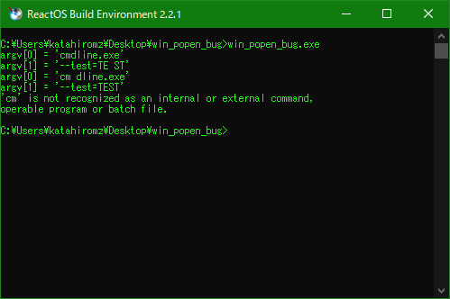

# Windows _popen bug found by @katahiromz

The following code works:

```c
fp = _popen("cmdline.exe \"--test=TE ST\"", "rb"); /* SUCCESSFUL */
if (fp)
{
    while (fgets(buf, 256, fp))
    {
        fputs(buf, stdout);
    }
    _pclose(fp);
}
else
{
    fprintf(stderr, "ERROR: Cannot execute 'cmdline.exe'\n");
    return -1;
}
```

But the following code won't work:

```c
fp = _popen("\"cm dline.exe\" \"--test=TE ST\"", "rb"); /* BUG: this is failed */
if (fp)
{
    while (fgets(buf, 256, fp))
    {
        fputs(buf, stdout);
    }
    _pclose(fp);
}
else
{
    fprintf(stderr, "ERROR: Cannot execute 'cm dline.exe'\n");
    return -2;
}
```


